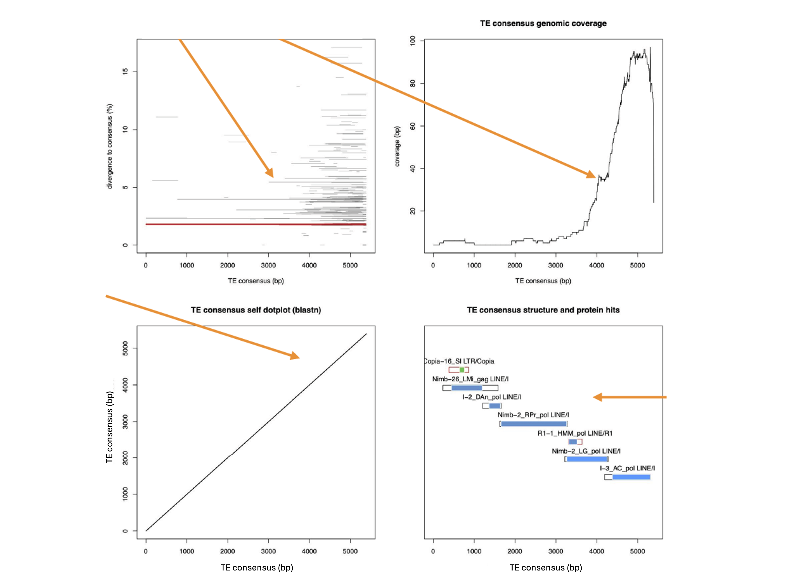
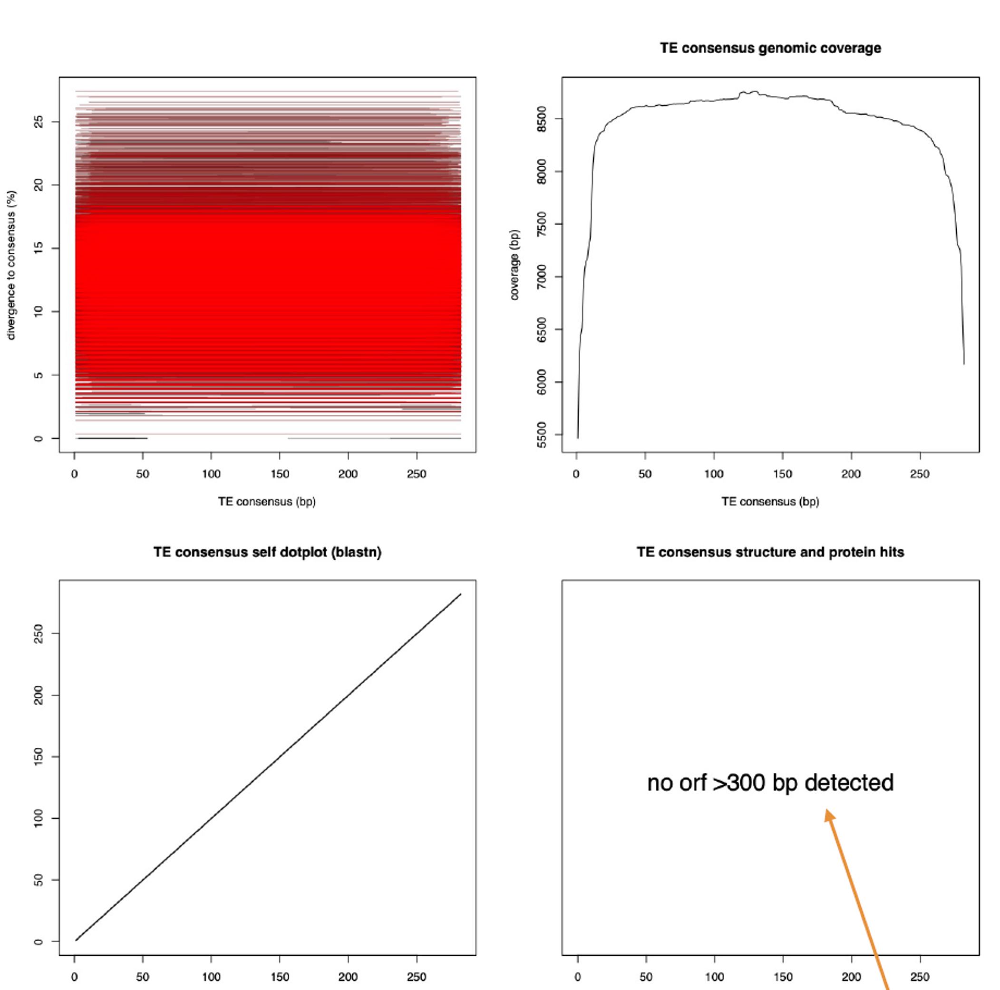
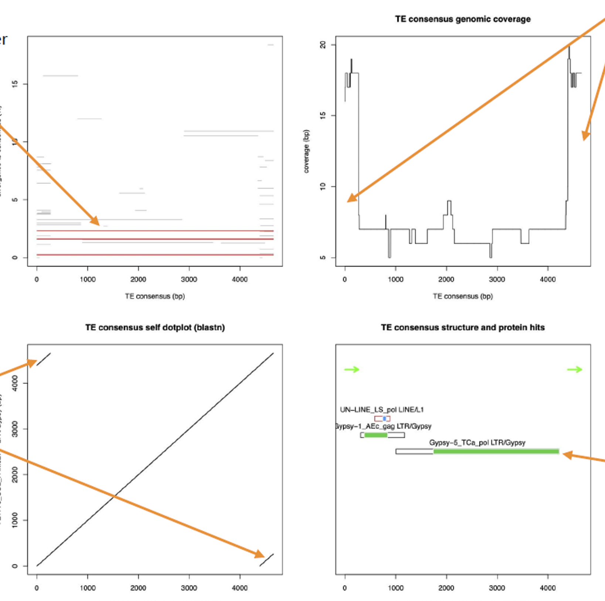
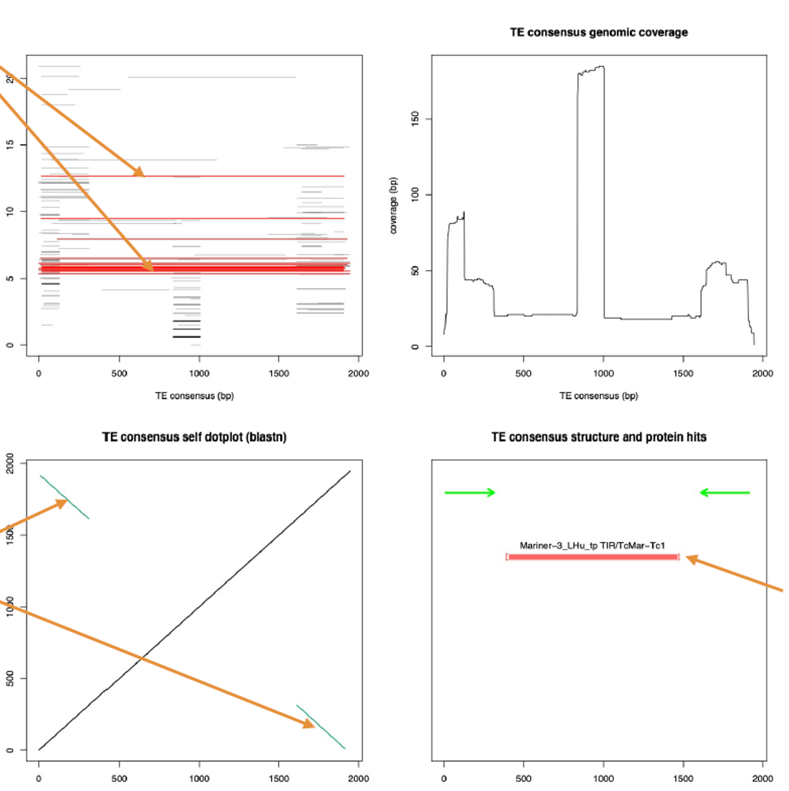
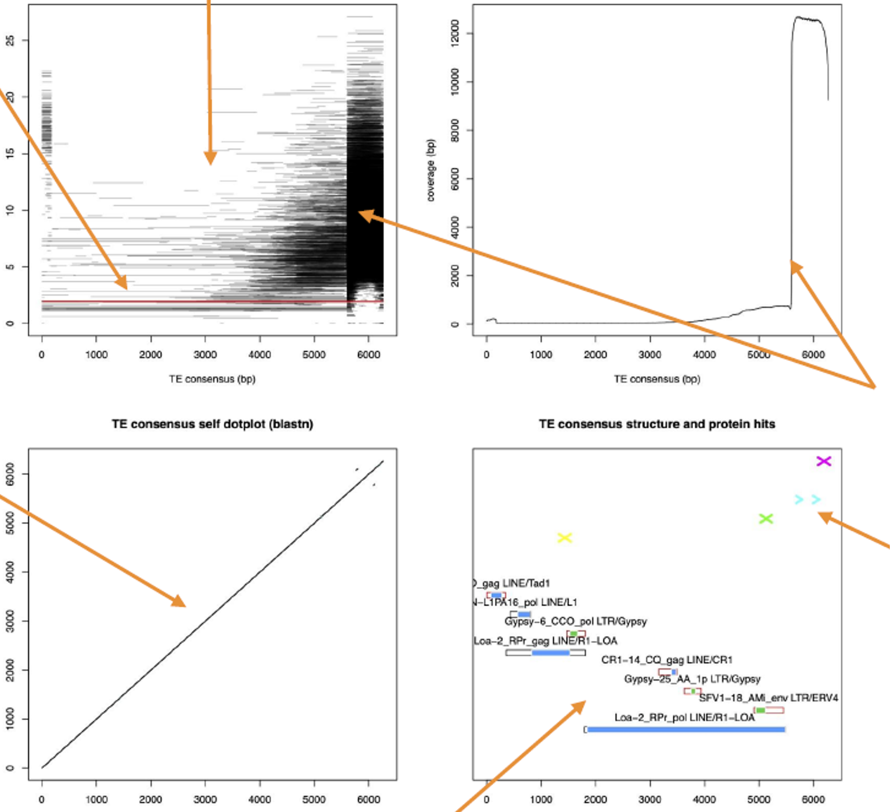
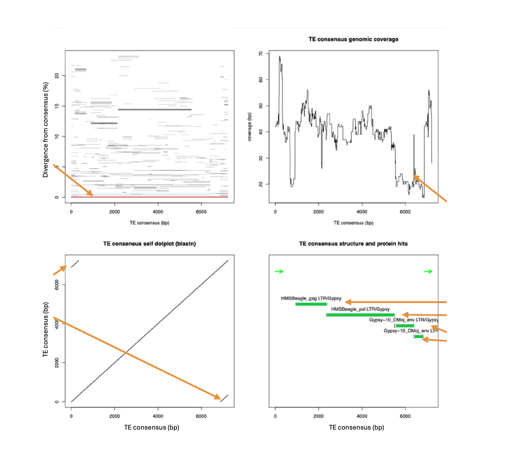
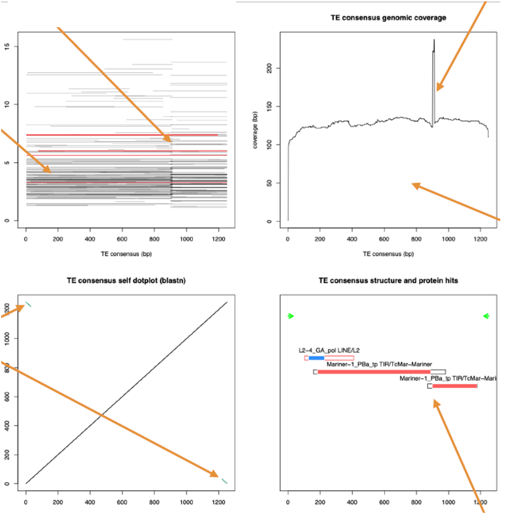

# Practical 2 - part 1

## Exploration of TE diversity <a name="TEdiversity"></a>

<p align="center"><figure></figure></p>

In this tutorial I give you plots generated by TEAid to look at the features of some TE consensus sequences so to get an idea of how to distinguish the different types of TEs and try to classify them. Use the last slides of the lecture where I added some very useful classification tables.

I used [TE-Aid](https://github.com/clemgoub/TE-Aid) (which takes our TE consensus sequences as input (fasta file), aligns them to a reference genome) to produce 4 different plots reporting (**Figure 2**):

- (top left) the genomic hits with divergence to consensus
- (top right) the genomic coverage of the consensus
- (bottom left) a self dot-plot
- (bottom right) a structure analysis including: TIR and LTR suggestions, open reading frames (ORFs) and TE protein hit annotation.

<p align="center"><figure><figcaption><strong>Figure 2.</strong> TE-Aid example output. Image from <a href="https://mobilednajournal.biomedcentral.com/articles/10.1186/s13100-021-00259-7">Goubert et. al 2022</a>.</figcaption></figure></p>


You're also free to try TE-Aid out using the consensus sequences the repeat library we produced here today. Running TE-Aid is rather simple, here how a TE-Aid command looks like:

```bash
TE-Aid [-q|--query <query.TE.fa>] [-g|--genome <genome.fa>] [options]
```

Where the query is your consensus sequence and the genome is the reference assembly.

Investigate the plots with the help of the slides from the lecture AND with the help of the classification tables provided on Github.

Good luck :D

### "Canonical" repeats

**Plot1**

<p align="center"><figure></figure></p>

---

**Plot2**

<p align="center"><figure></figure></p>

---

**Plot3**

<p align="center"><figure></figure></p>

---

**Plot4**

<p align="center"><figure></figure></p>

### More challenging repeats

**Plot5**

<p align="center"><figure></figure></p>

---

**Plot6**

<p align="center"><figure></figure></p>

---

**Plot7**

<p align="center"><figure></figure></p>

---

**Plot8**

<p align="center"><figure></figure></p>
